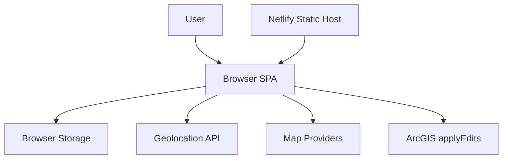

# LevisPotholeSignal Threat Model

## Executive summary

LevisPotholeSignal is a browser-delivered React application that collects precise GPS coordinates, reporter identity data, and traveler safety acknowledgements, then can submit selected pothole reports to an external ArcGIS `applyEdits` endpoint. The dominant risks are integrity abuse of the live submission workflow, privacy exposure from browser-side handling of identity and location-adjacent data, and the lack of repo-visible browser hardening around a deployment that depends on external mapping and reporting services.

## Scope and assumptions

- In scope:
  - `src/App.jsx`
  - `src/components/PotholeMapPreview.jsx`
  - `src/components/PassengerConfirmationModal.jsx`
  - `src/utils/arcgis.js`
  - `src/utils/maps.js`
  - `src/utils/movement.js`
  - `index.html`
  - `netlify.toml`
- Out of scope:
  - ArcGIS server-side configuration and access controls
  - Netlify edge/CDN settings not stored in this repo
  - Device/browser OS security, browser extension security, and the City of Levis official systems
- Assumptions:
  - The app is deployed as a public static site over HTTPS on Netlify or an equivalent host.
  - `VITE_ALLOW_REAL_SUBMISSION` may be enabled in some environments, exposing the live ArcGIS write path to end users.
  - No separate backend exists for this app in the repo; the browser talks directly to third-party services.
  - Reporter name and email are considered moderately sensitive PII, and precise pothole coordinates are integrity-sensitive data.
  - The current map point labels are internally generated and not user-controlled.
- Open questions that would materially change ranking:
  - Does the ArcGIS layer require authentication, rate limiting, moderation, or origin restrictions outside this repo?
  - Is production intended for public internet use, or only limited demos/internal use?
  - Are Netlify or CDN response headers already setting CSP, clickjacking, and referrer protections?

## System model

### Primary components

- Browser UI: React/Vite SPA that manages user profile, session role, travel state, pothole selection, and outbound submissions. Evidence anchors: `src/App.jsx`, `src/main.jsx`.
- Browser storage: `localStorage` stores name/email and `sessionStorage` stores session role acknowledgement. Evidence anchors: `src/App.jsx:77-123`, `src/App.jsx:454-482`.
- Geolocation subsystem: `navigator.geolocation.getCurrentPosition` and `watchPosition` provide live location and movement state. Evidence anchors: `src/App.jsx:301-408`, `src/App.jsx:588-618`.
- Mapping subsystem: Leaflet renders selected potholes, opens Google Maps deep links, and loads configurable map tiles. Evidence anchors: `src/components/PotholeMapPreview.jsx`, `src/utils/maps.js`.
- Reporting integration: the SPA formats ArcGIS attributes and submits them directly to the ArcGIS `applyEdits` REST endpoint. Evidence anchors: `src/App.jsx:14-16`, `src/App.jsx:730-800`, `src/utils/arcgis.js:25-33`.
- Static hosting/build: Vite bundles the app and Netlify publishes `dist/`. No repo-visible response headers are configured. Evidence anchors: `vite.config.js`, `netlify.toml`, `index.html`.

### Data flows and trust boundaries

- User -> Browser UI
  - Data types: session role, name, last name, email, button clicks, point selection.
  - Channel/protocol: browser DOM events.
  - Security guarantees: React escaping-by-default for JSX text; client-side validation for required fields and email format in `validateProfile`.
  - Validation/normalization: trims strings and rejects missing/invalid email. Evidence: `src/App.jsx:164-181`, `src/App.jsx:468-486`.
- Browser UI -> Browser storage
  - Data types: reporter identity, accepted role, consent timestamp.
  - Channel/protocol: `localStorage` and `sessionStorage`.
  - Security guarantees: none beyond same-origin browser access controls.
  - Validation/normalization: JSON parse plus presence checks when reloading storage. Evidence: `src/App.jsx:77-123`, `src/App.jsx:454-482`.
- Browser UI -> Geolocation API
  - Data types: permissioned location samples, speed, timestamps.
  - Channel/protocol: Web Geolocation API.
  - Security guarantees: browser permission prompt; runtime checks for API availability.
  - Validation/normalization: movement calculations discard invalid or stale samples. Evidence: `src/App.jsx:301-408`, `src/utils/movement.js`.
- Browser UI -> External map providers
  - Data types: tile requests, point coordinates in Google Maps links.
  - Channel/protocol: HTTPS tile fetches and Google Maps search URLs.
  - Security guarantees: relies on browser HTTPS and provider behavior; no repo-visible allowlist beyond defaults.
  - Validation/normalization: coordinates coerced through `Number(...)`; tile config can be overridden by environment variables. Evidence: `src/components/PotholeMapPreview.jsx:56-59`, `src/components/PotholeMapPreview.jsx:236-244`, `src/utils/maps.js`.
- Browser UI -> ArcGIS edit endpoint
  - Data types: projected geometry, reporter name, reporter email, status.
  - Channel/protocol: HTTPS `POST` with `application/x-www-form-urlencoded`.
  - Security guarantees: browser TLS only; no repo-visible authn, authz, signing, CAPTCHA, or rate limiting.
  - Validation/normalization: client transforms coordinates into Web Mercator; success is checked from `addResults`. Evidence: `src/App.jsx:755-790`, `src/utils/arcgis.js`.

#### Diagram

## Assets and security objectives

| Asset | Why it matters | Security objective (C/I/A) |
| --- | --- | --- |
| Reporter identity (name, email) | Ties a person to reported locations and can be abused for impersonation or privacy harm. | C, I |
| Selected pothole coordinates | Location data drives the core business action and can pollute external datasets if falsified. | I, A |
| Session role and safety acknowledgement | Supports the app's road-safety gating and affects whether capture is allowed during movement. | I |
| ArcGIS reporting path | A misused write path can corrupt downstream records or attract spam. | I, A |
| Build-time configuration (`VITE_ALLOW_REAL_SUBMISSION`, map tile settings) | Changes whether public users can send live data and where map content is loaded from. | I |
| Static build artifacts | If compromised, they can run arbitrary code in users' browsers. | I, C |

## Attacker model

### Capabilities

- Remote internet user who can access the deployed app and use or script its public browser flows.
- User who can tamper with their own browser state, devtools, or local storage values.
- Phishing or clickjacking operator who can try to embed the public site if framing is allowed.
- Malicious browser extension or any future same-origin XSS payload that can read DOM/storage and intercept network requests.
- Operator or supply-chain attacker who can alter build-time environment variables or published static assets.

### Non-capabilities

- No evidence of server-side code, privileged admin console, or internal network reachability in this repo.
- No evidence of cookies, sessions, bearer tokens, or other reusable auth artifacts in the browser.
- No evidence that ordinary remote attackers can change `VITE_*` values at runtime without compromising the deployment pipeline.

## Entry points and attack surfaces

| Surface | How reached | Trust boundary | Notes | Evidence (repo path / symbol) |
| --- | --- | --- | --- | --- |
| Role selection and profile form | Public landing/setup UI | User -> Browser UI | Collects name and email; role drives safety behavior. | `src/App.jsx` / `ROLE_OPTIONS`, `handleSetupSubmit` |
| Geolocation capture | Button click plus browser permission grant | Browser UI -> Geolocation API | Supplies precise coordinates and movement telemetry. | `src/App.jsx` / `capturePotholeFromGps`, `watchPosition` |
| Live ArcGIS submission | Review screen -> submit button | Browser UI -> ArcGIS | Direct write path to external dataset. | `src/App.jsx` / `reportSelectedPotholes` |
| Map tile loading | Rendering selected points | Browser UI -> Map Providers | URL and attribution are configurable via `VITE_*`. | `src/components/PotholeMapPreview.jsx`, `src/utils/maps.js` |
| Google Maps deep links | Review screen point cards | Browser UI -> External navigation | Opens external app/site with selected coordinates. | `src/components/PotholeMapPreview.jsx` / `buildGoogleMapsSearchUrl` |
| Browser storage reload | App startup | Browser storage -> Browser UI | Rehydrates profile and session role. | `src/App.jsx` / `readSavedProfile`, `readSavedSession` |

## Top abuse paths

1. An attacker discovers a deployment with live mode enabled, replicates the `applyEdits` request shape, and scripts forged submissions to pollute or spam the ArcGIS layer.
2. A shared-device user leaves the browser open; the next person reads persisted name/email data from browser storage and correlates it with recent reporting activity.
3. A future XSS or malicious extension executes in the app origin, reads `localStorage` and in-memory pothole selections, then exfiltrates reporter identity and location-derived data.
4. A phishing page embeds the app, tricks a victim into interacting with the framed UI, and induces geolocation permission or unintended submission clicks.
5. A compromised deployment pipeline changes `VITE_MAP_TILE_URL` to an attacker-controlled map service, allowing tracking of viewers and manipulated map content.
6. A compromised build or future unreviewed feature passes attacker-controlled text into Leaflet HTML sinks, leading to full origin compromise in the absence of CSP.
7. An attacker or curious user opens devtools during default simulation mode and retrieves precise point coordinates and reporter identity from console logs.

## Threat model table

| Threat ID | Threat source | Prerequisites | Threat action | Impact | Impacted assets | Existing controls (evidence) | Gaps | Recommended mitigations | Detection ideas | Likelihood | Impact severity | Priority |
| --- | --- | --- | --- | --- | --- | --- | --- | --- | --- | --- | --- | --- |
| TM-001 | Remote internet user or bot | Production enables live mode and ArcGIS accepts current unauthenticated request shape. | Sends forged `applyEdits` requests directly to ArcGIS, bypassing the intended user flow. | Downstream dataset poisoning, impersonation of reporters, spam, and operational cleanup costs. | ArcGIS reporting path, reporter identity, selected pothole coordinates | Live mode is off by default and a confirm dialog exists in the UI. Evidence: `src/App.jsx:16`, `src/App.jsx:755-757`, `README.md:58-60`. | Controls are client-side only and do not constrain scripted requests. | Proxy writes through a backend/serverless layer, require auth or abuse controls, validate coordinates/schema server-side, and rate limit per user/IP/device. | Alert on submission spikes, repeated emails, repeated coordinates, or impossible geographic distributions in ArcGIS logs. | Medium to high | High | high |
| TM-002 | Same-origin script, malicious extension, or shared-device local attacker | Victim uses the app on a shared or compromised browser. | Reads persistent profile/session data from browser storage and harvests location-related output from memory or logs. | Privacy loss and identity exposure tied to reporting activity. | Reporter identity, session role data | App validates and parses stored JSON defensively. Evidence: `src/App.jsx:77-123`. | No expiry, no explicit opt-in for persistence, and simulation mode logs sensitive data. | Make identity storage session-only by default, add clear-storage controls, and remove/redact production logs. | Add runtime telemetry for unexpected storage reads if a backend is introduced; lint against logging PII. | Medium | Medium | medium |
| TM-003 | Future XSS payload, malicious build, or operator misconfiguration | Attacker gains control of HTML-bearing content or deployment configuration. | Injects script-bearing markup through Leaflet HTML sinks or malicious attribution content. | Full origin compromise with access to storage, geolocation-derived state, and outbound requests. | Static build artifacts, reporter identity, ArcGIS path | React escapes normal JSX text, and current point labels are internally generated. Evidence: `src/App.jsx`, `src/components/PotholeMapPreview.jsx:14-18`. | No repo-visible CSP; Leaflet icon/tooltip rendering still uses raw HTML strings. | Add CSP and frame protections at the edge, keep HTML sinks restricted to internal numeric labels, and sanitize any future HTML content before rendering. | Monitor deployed headers, integrity changes, and unexpected markup in telemetry/screenshots. | Low to medium | High | medium |
| TM-004 | Clickjacking/phishing operator | The deployed site can be framed and a victim is willing to interact. | Embeds the app in a deceptive page and tries to induce geolocation permission or form submission. | Privacy leakage and unintended use of the reporting workflow. | Reporter identity, selected pothole coordinates, ArcGIS path | Browser geolocation prompts still require user interaction; the UI has multiple steps. Evidence: `src/App.jsx` multi-screen flow, `index.html`. | No repo-visible `frame-ancestors` or `X-Frame-Options`; no anti-framing logic in app code. | Set `frame-ancestors 'none'` or `X-Frame-Options: DENY`, and add clear branding/origin guidance for public deployments. | Watch referrers/origins at the edge and alert on unusual embedding traffic. | Low to medium | Medium | medium |
| TM-005 | Operator or supply-chain attacker | Ability to change `VITE_MAP_TILE_URL`, `VITE_MAP_TILE_ATTRIBUTION`, or published assets. | Routes users to a hostile tile provider or injects tracking/manipulated map content. | User tracking, misleading UI, and possible content injection. | Build-time configuration, static build artifacts, user privacy | Defaults point to OpenStreetMap and static Google Maps URLs. Evidence: `src/utils/maps.js:1-23`. | No allowlist, integrity policy, or sanitization for operator-supplied map settings. | Allowlist approved tile hosts, review env changes in deployment, and avoid arbitrary HTML attribution overrides. | Alert on config drift and unexpected outbound tile domains. | Low | Medium | low |
| TM-006 | Remote user or upstream dependency failure | External map or ArcGIS services are degraded, or live mode is abused at volume. | Causes map rendering failure or repeated submission errors that block legitimate use. | Reduced availability and user trust. | ArcGIS path, map providers, app availability | Simulation mode is default, and build/tests are simple and reproducible. Evidence: `src/App.jsx:197`, `README.md:54-60`. | No offline queue, retry policy, or degraded-mode instrumentation for third-party outages. | Add user-visible degraded-mode handling, operational monitoring, and rate controls when live mode is enabled. | Track fetch failures, tile load failures, and ArcGIS error rates by deployment version. | Medium | Medium | medium |

## Criticality calibration

- Critical
  - A confirmed pre-auth path that lets any remote user execute arbitrary JavaScript in the deployed origin.
  - A confirmed ability to submit forged ArcGIS edits at scale with no downstream controls.
- High
  - Anonymous or easily automated live-report forgery that materially corrupts the target dataset.
  - Bulk exfiltration of reporter identity plus location data from a real deployment.
  - Deployment compromise that swaps published assets or injects hostile third-party script.
- Medium
  - Clickjacking or phishing that depends on user interaction and browser permission prompts.
  - Privacy leakage from local storage or console output on shared/compromised devices.
  - Service degradation caused by upstream ArcGIS or tile-provider instability.
- Low
  - Misconfiguration risks that require operator or pipeline compromise first.
  - Defensive gaps with no present exploit path in the current code, but that could become dangerous after future feature changes.

## Focus paths for security review

| Path | Why it matters | Related Threat IDs |
| --- | --- | --- |
| `src/App.jsx` | Central trust boundary for profile collection, geolocation, storage, and ArcGIS submission. | TM-001, TM-002, TM-004, TM-006 |
| `src/utils/arcgis.js` | Defines the payload sent to the external write endpoint and the integrity-critical response checks. | TM-001 |
| `src/components/PotholeMapPreview.jsx` | Contains Leaflet HTML sinks, external links, and map rendering behavior. | TM-003, TM-005 |
| `src/utils/maps.js` | Holds external map provider URLs and operator-controlled configuration inputs. | TM-003, TM-005 |
| `index.html` | Entry document where CSP/meta hardening would be visible for static hosting. | TM-003, TM-004 |
| `netlify.toml` | Deployment config where repo-visible security headers could be enforced. | TM-003, TM-004 |
| `README.md` | Documents deployment assumptions and current live-mode expectations that affect threat ranking. | TM-001, TM-006 |

## Quality check

- All runtime entry points discovered in the repo are covered: profile form, storage rehydration, geolocation, map rendering, Google Maps links, and ArcGIS submission.
- Each trust boundary is represented in at least one threat: user input, browser storage, geolocation API, external map providers, and ArcGIS.
- Runtime behavior is separated from build/deploy tooling and tests; there is no evidence of server-side runtime code in scope.
- User clarifications are still pending on ArcGIS controls, deployment exposure, and edge headers; current priorities are conditional on those assumptions.
- Assumptions and open questions are explicit above and are the main factors that could raise or lower TM-001, TM-003, and TM-004.
